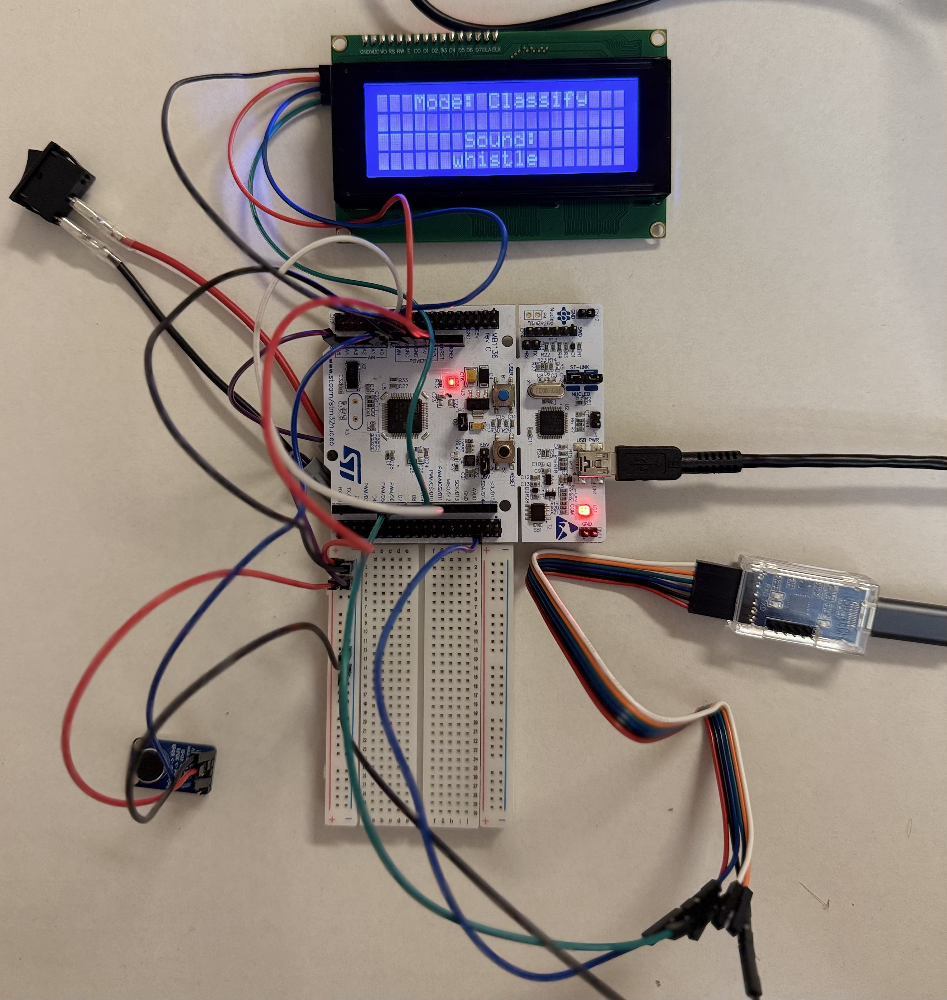
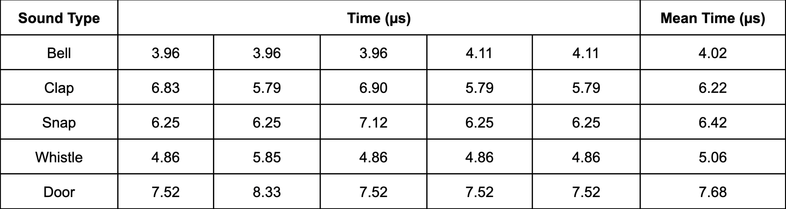
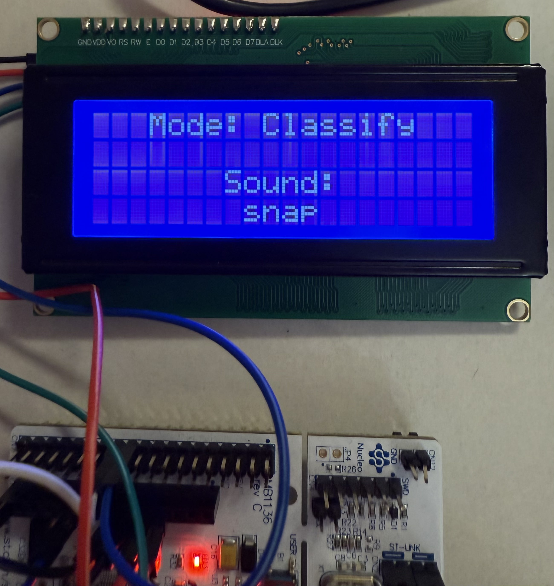
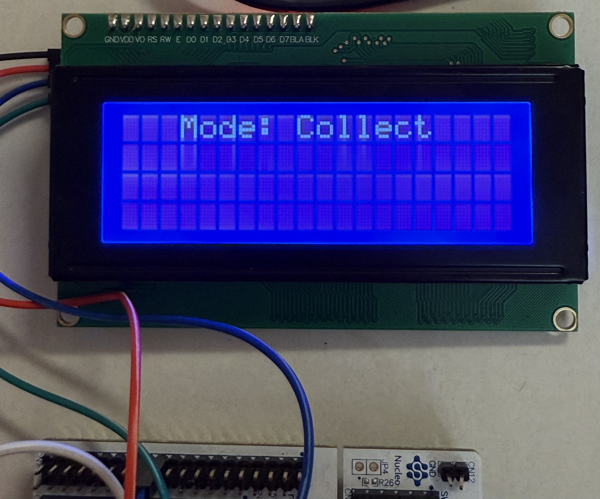

# Sound Classifier

### Short Overview ###

An embedded sound classification system built on an STM32F446RE. The system samples microphone audio using ADC and DMA, extracts six time- and frequency-domain features on-device, and uses a decision tree trained with scikit-learn for classification. The trained model is converted to C and deployed back to the STM32 for on-device inference, with predictions displayed on an I2C LCD.

**Pipeline:** Microphone → ADC/DMA Sampling → Feature Extraction →
Decision Tree → LCD Prediction

**Specifications:**

- Final model: 78.0% mean 5-fold CV accuracy
- Inference: ~5.88 µs average at 84 MHz
- Classes: Bell, Clap, Door, Snap, Whistle
- Sampling: 4 kHz, 4,096 samples/frame

---
### Embedded System

#### Hardware

STM32 Nucleo-F446RE Development Board — 84 MHz ARM Cortex-M4

MAX9814 Electret Microphone Amplifier — Automatic Gain Control (AGC)

20×4 Character LCD — I2C interface

External SPST Toggle Switch — mode selection

On-board User Push Button — sampling trigger

#### Sampling

ADC resolution: 12-bit

ADC conversion time: About 0.76 microseconds/conversion

Sample buffer size: 8.192 KB of RAM

Sampling rate: 4 kHz (4000 samples/second)

Sampling interval: 250 microseconds/sample

Frame size: 4096 samples

Frame acquisition time: 1.024 seconds/frame

ADC data transfer: DMA-assisted

#### Feature Extraction & Transmission

Features extracted: Energy, ZCR, peak amplitude, dominant frequency, spectral centroid, spectral bandwidth

Signal-processing buffer memory: ~40.96 KB RAM total

- Centered samples buffer: 16.385 KB

- FFT output buffer: 16.385 KB

- Magnitude buffer: 8.192 KB

Measured total feature extraction time: About 192 milliseconds/frame

Feature transmission: DMA-assisted USART

USART baud rate: 115,200 baud

Maximum estimated feature transmission time: About 11.1 ms

#### Notifications ####

Sampling start notification transmission time: 2.00 milliseconds

Intermediate notification transmission time: 4.00 milliseconds

Processing end notification transmission time: 2.00 milliseconds

## Data Collection Pipeline

#### MAX9814 → ADC → DMA → Sample Buffer → Feature Extraction → Six-Feature Vector → USART → Python → Database/Dataset → Model Training

---

### Model Training & Testing ###

#### *Run 1*

Sound types: *Bell, Clap, Door, Sink, Snap, Whistle*

Frames per sound: 30 frames

Technologies: SQL database, scikit-learn, matplotlib, pandas

Training/testing methodology: Used a stratified train/test split to train and evaluate decision trees across multiple random states.

Experimental change: Tested multiple random states to observe the effect of different train/test splits and tree initialization.

Test accuracy: 38-47%

Observations: Dominant frequency and ZCR tend to be the root nodes. Energy is used towards the end. Peak amplitude is used only twice across the three trees.

Dominant frequency and ZCR seem to be the most informative features. Per-class accuracy also varies significantly, likely due to the small dataset.

More data is needed to determine the next step.

#### *Run 2*

Sound types: *Bell, Clap, Door, Sink, Snap, Whistle*

Frames per sound: 100 frames

Training/testing methodology: Expanded on Run 1 by introducing support for 5-fold cross-validation and confusion matrix analysis.

Experimental change: Varied the random states of the KFold splitter and decision tree across each run, resulting in different fold partitions and trees.

Mean 5-fold CV accuracy: 49-52%

Observations: Even with more data, the results are underwhelming.

I will add more features to give the model more information to work with. These two new features are spectral centroid and spectral bandwidth. The spectral centroid describes where most of the sound's energy is concentrated, which is much richer information. Spectral bandwidth measures how spread out the frequencies are, which can further help distinguish sounds.

Since the ‘sink’ sound type consistently achieved an accuracy of 14-19%, I will remove it for future runs because my main goal is to develop a working embedded classification prototype, and the complexity of distinguishing the sink class seems increasingly out of scope for a prototype.

#### *Run 3 (Final Model)*

Sound types: *Bell, Clap, Door, Snap, Whistle*

Frames per sound: 120 frames

Training/testing methodology: Expanded on Run 2 by testing various max depth levels.

Experimental change: Removed ‘sink’ sound type. Increased number of frames per sound. Added two new features: Spectral Centroid and Spectral Bandwidth.

Mean 5-fold CV accuracy (max depth = 10): 73-77%

Although larger max depths resulted in slightly higher average accuracies, the marginal improvement beyond a max-depth of 10 did not justify the additional model complexity.

Average accuracy across different maximum tree depths:

Final decision tree (max depth = 10, random state = 42):

Observations: Mean cross-validation accuracy has improved from approximately 50% in Run 2 to approximately 76% in Run 3.

The changes made (new features, removing ‘sink’, max depth) significantly improved overall accuracy.

The ‘whistle’ sound type consistently scored the highest.

According to the confusion matrix, the model’s biggest problem is distinguishing between the ‘door’, ‘clap’, ‘and ‘snap’ sound types which makes sense because they’re all short, impulsive sounds resulting in similar feature data.

Future improvements:

*Investigate and introduce features specifically meant to differentiate short sounds like ‘door’, ‘clap’, and ‘snap’.*

---

### Deployment ###

Final model selection: The deployed model was the highest-performing of the three runs, achieving a mean 5-fold cross-validation accuracy of 78.00% with random state 42.

m2cgen conversion: The final scikit-learn decision tree was converted to C using m2cgen and integrated into the STM32 firmware for on-device classification.

STM32 integration: The generated model was integrated into the STM32 firmware through `classify_audio()`, which accepts the six extracted audio features and writes the model output to a five-element output buffer. Each position corresponds to a sound class, with the predicted class represented by 1.0.

Inference timing:

<small>*Note: Inference time measured using the Cortex-M4 cycle counter at an 84 MHz CPU clock, with cycle-counter measurement overhead subtracted.*</small>

Average inference time: 5.88 microseconds

Maximum observed inference time: 8.33 microseconds (door)

LCD output:

Boot → initialization message

Classify mode → Mode: Classify + Sound: → button press → prediction displayed

Collect mode → Mode: Collect

Toggle switch → switches between modes

---

### Licenses

Portions of the I2C LCD driver are adapted from Aleksander Alekseev's
`stm32-i2c-lcd-1602` project (Copyright © 2018), licensed under the MIT License.

CMSIS components used by this project are provided by Arm Limited and
licensed under the Apache License 2.0.

STM32 HAL and STM32-specific CMSIS components used by this project are
provided by STMicroelectronics under their respective license terms.

Third-party license notices can be found in the `LICENSES/` directory.